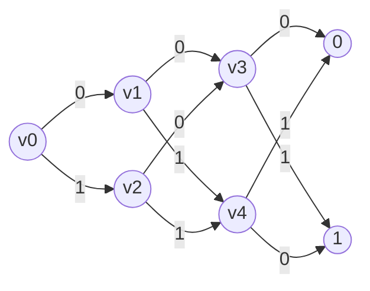
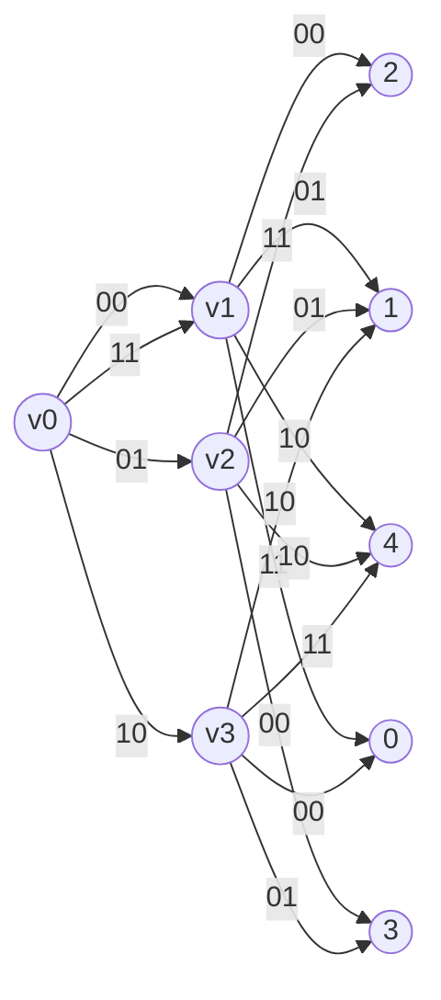

## Read-Once Branching Program (ROBP) 
For $w \in \mathbb{N}$, a width-$w$ read-once branching program (ROBP) over an alphabet $\Sigma = \{0, 1\}^b$ consists of a layered directed graph $G = (V, E)$, with $n + 1$ layers. The first layer, denoted layer 0, consists of a single vertex known as the source. Each subsequent layer consists of at most $w$ vertices. The vertices in the last layer (aka layer n) are called sinks and are each labeled by a field element.

Each vertex $v$ in layer $i < n$ has exactly $2^b$ outgoing edges, labeled by all of the strings in $\Sigma$ each of which goes into layer $i + 1$ (or directly to a sink). For every symbol $\sigma\in\{0, 1\}^b$, we denote the neighbor of $v$ that is incident to the outgoing edge that is labeled by $\sigma$, by $\varGamma(v, \sigma)$.

## Example 1
A width-2 read-once branching program (ROBP) over the alphabet $\Sigma = \{0,1\}$ (i.e., $b=1$) with $n=3$ and $n+1 = 4$ layers:

Edge definitions:
$$
\begin{aligned}
    &\varGamma(v_0, 0) = v_1, \varGamma(v_0, 1) = v_2,\\
    &\varGamma(v_1, 0) = v_3, \varGamma(v_1, 1) = v_4,\\
    &\varGamma(v_2, 0) = v_3, \varGamma(v_2, 1) = v_4\\
    &\varGamma(v_3, 0) = 0\space\space\text{(sink)}, \varGamma(v_3, 1) = 1\space\space\text{(sink)}\\
    &\varGamma(v_4, 0) = 1\space\space\text{(sink)}, \varGamma(v_4, 1) = 0\space\space\text{(sink)}\\
\end{aligned}
$$
This ROBP computes the following function. The input of this function is equal to $(\{0, 1\}^b)^n = (\{0, 1\}^1)^3 = \{0, 1\}^3$ which we can use in the function as bit-string for example $001$ or like (0, 0, 1). So for input $x_1, x_2, x_3\in\{0, 1\}^3$:
$$
f: \{0, 1\}^3\rightarrow\mathbb{F}
$$
$$
f(x_1, x_2, x_3) = \begin{cases}
    x_3\qquad\space\space\space\text{if }\space(x_1 = 0 \land x_2 = 0)\lor (x_1 = 1 \land x_2 = 0)\\
    -x_3\qquad\text{otherwise.}
\end{cases}
$$

## Example 2
A width-3 ROBP example with alphabet $\Sigma = \{0,1\}^2 = \{00, 01, 10, 11\}$ ($b=2$) and $n=2$ ($n+1 = 3$ total layers, including sinks):

Edge definitions:
$$
\begin{aligned}
    &\varGamma(v_0, 00) = v_1, \varGamma(v_0, 01) = v_2, \varGamma(v_0, 10) = v_3, \varGamma(v_0, 11) = v_1,\\
    &\varGamma(v_1, 00) = 2\space\space\text{(sink)}, \varGamma(v_1, 01) = 1\space\space\text{(sink)}, \varGamma(v_1, 10) = 4\space\space\text{(sink)}, \varGamma(v_1, 11) = 0\space\space\text{(sink)},\\
    &\varGamma(v_2, 00) = 3\space\space\text{(sink)}, \varGamma(v_2, 01) = 1\space\space\text{(sink)}, \varGamma(v_2, 10) = 4\space\space\text{(sink)}, \varGamma(v_2, 11) = 2\space\space\text{(sink)},\\
    &\varGamma(v_3, 00) = 0\space\space\text{(sink)}, \varGamma(v_3, 01) = 3\space\space\text{(sink)}, \varGamma(v_3, 10) = 1\space\space\text{(sink)}, \varGamma(v_3, 11) = 4\space\space\text{(sink)}
\end{aligned}
$$
For input of the function computed above graph $(\{0,1\}^b)^{n} = (\{0,1\}^2)^{2} = \{0,1\}^4$. In another point of view we can consider input like $x_1x_2\in\{00, 01, 10, 11\}^2$, which $x_1$ routes from $v_0$, and $x_2$ determines sink values from layer 1.

**evaluation of above function.** 
$$
\begin{aligned}
    &f(00, 10) = 4\qquad\text{(path: $v_0 \xrightarrow{00} v_1 \xrightarrow{10} 4$)}\\
    &f(11, 01) = 4\qquad\text{(path: $v_0 \xrightarrow{11} v_1 \xrightarrow{01} 1$)}\\
    &f(10, 00) = 0\qquad\text{(path: $v_0 \xrightarrow{10} v_3 \xrightarrow{00} 0$)}\\
\end{aligned}
$$
Note that this width-3 ROBP computes a function over 4 symbols (2-bit inputs) while tracking only 3 states at any step.

## Remark
Given an input $x \in \Sigma^n = (\{0,1\}^b)^n$, the ROBP is evaluated by starting at the source and proceeding on the
edge marked with $x_1$, then by $x_2$ and so forth. After $n$ such steps, we reach a sink and output its label. Intuitively, such a branching program captures a streaming algorithm with space $\log_2(w)$, where the vertices in layer $i$ represent all possible configurations of the memory at time step $i$.

## Definition $f_v$
For a vertex $v$ in layer $i$, denote by $f_v : (\{0, 1\}^b)^{n−i} \rightarrow\mathbb{F}$ the function obtained by running
the ROBP, but starting at $v$ (rather than the original source vertex).

For our Example 1, we consider $v_1$ at layer 1, since $n=3$ and $b=1$, then the input of function $f_{v_1}$ is $(\{0, 1\}^b)^{n−i} = (\{0, 1\}^1)^{3−1} = \{0,1\}^2$ and $f_{v_1}$ given by:
$$
\begin{aligned}
    &f_{v_1}: \{0,1\}^2 = \{00, 01, 10, 11\} \rightarrow\mathbb{F},\\
    &f_{v_1}(00) = 0,\\
    &f_{v_1}(01) = 1,\\
    &f_{v_1}(10) = 1,\\
    &f_{v_1}(11) = 0
\end{aligned}
$$
How about $f_{\varGamma(v_1, 0)}(z)$? Since $\varGamma(v_1, 0) = v_3$, then $f_{\varGamma(v_1, 0)}(z) = f_{v_3}(z)$ which $z\in\mathbb{F} = \{0,1\}$. Finally,
$$
\begin{aligned}
    &f_{\varGamma(v_1, 0)}(0) = f_{v_3}(0) = 0,\\
    &f_{\varGamma(v_1, 0)}(1) = f_{v_3}(1) = 1
\end{aligned}
$$
We can calculate the $f_{\varGamma(v_1, 1)}(z)$ as follow:
$$
\begin{aligned}
    &f_{\varGamma(v_1, 1)}(0) = f_{v_4}(0) = 1,\\
    &f_{\varGamma(v_1, 1)}(1) = f_{v_4}(1) = 0
\end{aligned}
$$
Now by noticing to above calculation we have a little extra result which we will introduce it latter as a lemma.
$$
\begin{aligned}
    &f_{\varGamma(v_1, 1)}(0) = f_{v_4}(0) = 1 = f_{v_1}(10),\\
    &f_{\varGamma(v_1, 1)}(1) = f_{v_4}(1) = 0 = f_{v_1}(11)
\end{aligned}
$$
For Example 2, we consider $v_2$ at layer 1, since $n=2$ and $b=2$, then the input of function $f_{v_2}$ is $(\{0, 1\}^b)^{n−i} = (\{0, 1\}^2)^{2−1} = \{0,1\}^2$ and $f_{v_2}$ given by:
$$
\begin{aligned}
    &f_{v_2}: \{0,1\}^2 = \{00, 01, 10, 11\} \rightarrow\mathbb{F},\\
    &f_{v_2}(00) = 3,\\
    &f_{v_2}(01) = 1,\\
    &f_{v_2}(10) = 4,\\
    &f_{v_2}(11) = 2
\end{aligned}
$$
You can write for any vertex $v$ a function $f_v$ by just using the graph.

Consider the symbol $\zeta = 110$ in $\mathbb{F}$ which is equal to $3\in\mathbb{F}$ and a vector $z$ in $(\mathbb{F}^b)^{n−i-1} = \mathbb{F}$ want to calculate the $\tilde{f}_{v_2}$

**Lemma 1.** For any vertex $v$ at layer $i<n$, and $\zeta\in\{0,1\}^b$, and $z\in(\{0,1\}^b)^{n-i-1}$
$$
f_{\varGamma(v, \zeta)}(z) = f_{v}(\zeta, z)\qquad\text{or bit-string format $f_{v}(\zeta z)$}
$$

## Claim 1
For every vertex $v$ in layer $i < n$, symbol $\zeta \in \mathbb{F}^b$ and vector $z \in (\mathbb{F}^b)^{n−i−1}$ it holds that:
$$
\begin{align}
    \tilde{f}_v(\zeta, z) = \sum_{\sigma\in\{0,1\}^b}eq(\zeta, \sigma) · \tilde{f}_{\varGamma(v,\sigma)}(z)
\end{align}
$$
**Proof.** Recall the fact that, two multilinear polynomials 
$f, g : \mathbb{F}^m \rightarrow \mathbb{F}$ that agree on every input in $\{0, 1\}^m$ (which we show in equality (4)) must also agree on every input in $\mathbb{F}^m$, and since both sides of the equation (1) are multilinear (in the variables $\zeta$ and z), it suffices to proof equation (1) for boolean-valued $\zeta\in\{0,1\}^b$ and $z\in(\{0,1\}^{b})^{n−i−1}$.

Now, since $eq(ζ, \sigma) = 0$, for all $\sigma\in\{0,1\}^{b}$ except for $\sigma=\zeta$, which is equal to 1, then the summation in this case:
$$
\sum_{\sigma\in\{0,1\}^b}eq(\zeta, \sigma) · \tilde{f}_{\varGamma(v,\sigma)}(z) =  \tilde{f}_{\varGamma(v,\zeta)}(z).
$$
On other han side, based on previous lemma 1, since:
$$
f_{\varGamma(v,\zeta)}(z) = f_v(\zeta, z),
$$
then,
$$
\tilde{f}_{\varGamma(v,\zeta)}(z) = \tilde{f}_v(\zeta, z)
$$
And finally equation (1) holds.
## Efficiently Compute the MLE of Function

The following lemma shows how to efficiently compute the MLE of functions computable by ROBP.

**Lemma 2.** Suppose that the function $f : (\{0, 1\}^b)^n \rightarrow\mathbb{F}$ can be computed by a width $w$ ROBP. Then $\tilde{f} : (\mathbb{F}^b)^n \rightarrow \mathbb{F}$ can be computed using $n · (w^2 + 2b)$ multiplications and $\mathrm{O}(n · w · 2b)$ additions.

Using Claim 1, the algorithm proceeds layer by layer and computes the evaluation of $\tilde{f}_v$, for every vertex $v$ (on the corresponding suffix of $z$). Eventually, the value obtained at the source vertex is precisely the desired $\tilde{f}f(z)$.

To obtain the desired number of multiplications we observe that for vertex $v$ in layer $i < n$, the equation (1) in Claim 1 can be rewritten as:
$$
\begin{align}
    \tilde{f}_v(\zeta, z) = \sum_{v^{\prime}\space\text{in layer}\space i + 1} \tilde{f}_{v^{\prime}}(z) · \sum_{\sigma\in\{0,1\}^b\space\text{s.t.}\space\varGamma(v,\sigma) = v^{\prime}}
eq(\zeta, \sigma).
\end{align}
$$
Thus, the algorithm first computes $eq(\zeta, ·)$ using $2^m$ multiplications and $2^m$ additions. Then, by enumerating all $v$ in layer $i$, and $\sigma \in \{0, 1\}^b$, it can compute 
$$
\Bigg(\sum_{\sigma\in\{0,1\}^b}\space\text{s.t.}\space\varGamma(v,\sigma)=v^{\prime} eq(\zeta, \sigma)\Bigg)_{v^{\prime}}
$$
for every $v^{\prime}$ in layer $i+1$.

Finally for every $v$ it uses equation (2) to layer $i$ it can use the generated data to compute $\tilde{f}_v(\zeta, z)$ using
an additional $w$ multiplications.